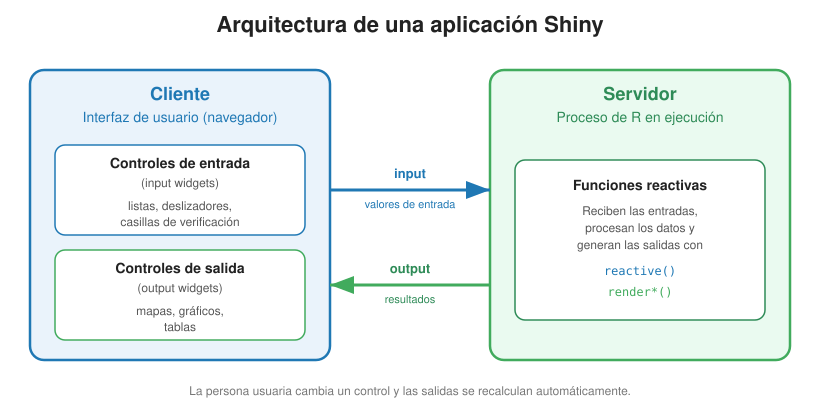
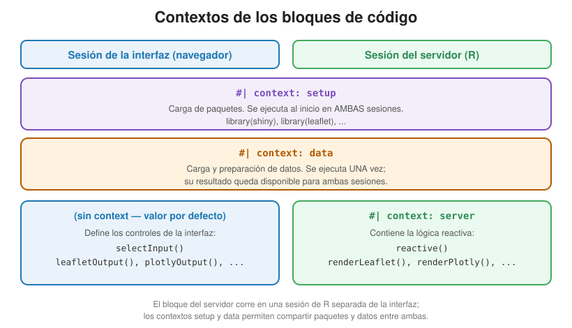
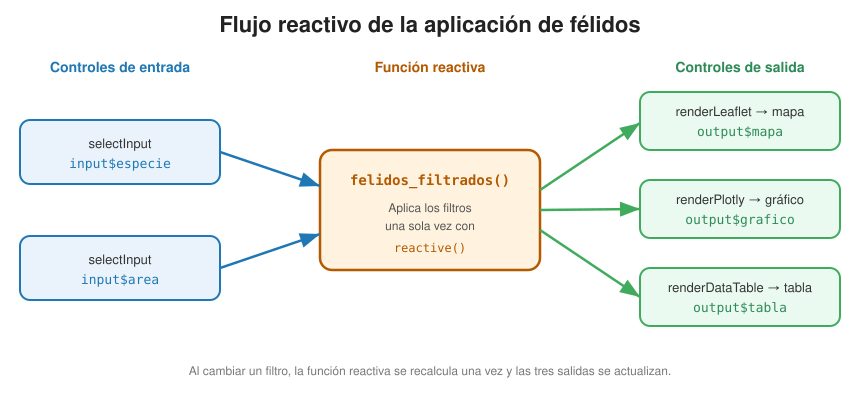

# Aplicaciones interactivas con Shiny {#sec-shiny}

En este capítulo se explica qué es una aplicación web interactiva y cómo desarrollarla con [Shiny](https://shiny.posit.co/), el paquete de R que añade interactividad del lado del servidor a los documentos Quarto. El capítulo está organizado como un **tutorial**: retoma el [tablero de control de riqueza de félidos](tableros/tablero-riqueza-felidos.html) del @sec-tableros-control y lo transforma, **paso a paso y elemento por elemento**, en una [aplicación interactiva](https://mfvargas.shinyapps.io/riqueza-felidos/) en la que la persona usuaria filtra los datos y todas las visualizaciones se actualizan en respuesta. Cada paso muestra el código **antes** (en el tablero estático) y **después** (en la aplicación), para que la transformación quede clara. Este ejercicio prepara el terreno para el proyecto final del curso, en el que cada estudiante convertirá el tablero de control que desarrolla en su tarea en una aplicación Shiny.

::: {.callout-note appearance="simple"}
## Aplicaciones de ejemplo de este capítulo

Este capítulo construye, paso a paso, la aplicación de **riqueza de félidos**. Esa aplicación y el **Atlas de Desarrollo Humano Cantonal** —un segundo ejemplo completo, con la misma estructura— están publicadas en línea, y su código fuente está disponible en GitHub:

| Aplicación | Aplicación en línea | Código fuente |
|---|---|---|
| **Riqueza de félidos de Costa Rica** | <https://mfvargas.shinyapps.io/riqueza-felidos/> | [repositorio](https://github.com/gf0604-procesamientodatosgeograficos/2026-i-aplicacion-riqueza-felidos) · [`index.qmd`](https://github.com/gf0604-procesamientodatosgeograficos/2026-i-aplicacion-riqueza-felidos/blob/main/index.qmd) |
| **Atlas de Desarrollo Humano Cantonal (edición 2025)** | <https://mfvargas.shinyapps.io/atlas-desarrollo-humano-2025/> | [repositorio](https://github.com/gf0604-procesamientodatosgeograficos/atlas-desarrollo-humano-2025) · [`index.qmd`](https://github.com/gf0604-procesamientodatosgeograficos/atlas-desarrollo-humano-2025/blob/main/index.qmd) |

El tablero de control estático que sirve de punto de partida también está disponible en línea: [tablero publicado](https://gf0604-procesamientodatosgeograficos.github.io/2026-i-tablero-riqueza-felidos/) · [repositorio](https://github.com/gf0604-procesamientodatosgeograficos/2026-i-tablero-riqueza-felidos).
:::

## Resumen

Un tablero de control publicado como página estática (como el del @sec-tableros-control) muestra siempre las mismas visualizaciones: la persona usuaria puede explorar los mapas y las tablas, pero no puede cambiar *qué* datos se procesan. Una **aplicación interactiva** sí lo permite: incorpora controles de entrada (*widgets*) —listas de selección, deslizadores, casillas de verificación— con los que la persona usuaria configura filtros, búsquedas u ordenamientos, y las salidas se recalculan dinámicamente.

Para lograr esto, una aplicación Shiny tiene dos componentes: una **interfaz de usuario**, que despliega los controles de entrada y de salida, y un **servidor**, un proceso de R que recibe las entradas, procesa los datos y devuelve los resultados a la interfaz. La comunicación entre ambos se realiza mediante **funciones reactivas**, que se ejecutan automáticamente cada vez que la persona usuaria cambia un control.

La segunda mitad del capítulo aplica estos conceptos en un tutorial que convierte, paso a paso, el tablero de félidos en la aplicación interactiva.

## Trabajo previo

### Lecturas

Quarto - Dashboards with Shiny for R. (s.f.). <https://quarto.org/docs/dashboards/interactivity/shiny-r.html>

Quarto - Shiny Interactive Documents. (s.f.). <https://quarto.org/docs/interactive/shiny/>

## Introducción

En una aplicación interactiva, la persona usuaria configura las salidas, usualmente mediante una interfaz que le permite realizar operaciones como filtros, búsquedas y ordenamientos, entre otras. [Shiny](https://shiny.posit.co/) es un paquete de R que facilita el desarrollo de este tipo de aplicaciones.

A diferencia de un tablero de control estático, que se publica como una página HTML autocontenida (por ejemplo, en GitHub Pages), una aplicación Shiny requiere un [servidor](https://posit.co/products/open-source/shinyserver/): un proceso de R que se mantiene en ejecución para atender las solicitudes de la persona usuaria. Ese servidor puede alojarse en:

- La estación de trabajo de quien programa (opción usada principalmente para desarrollo y pruebas).
- Un servidor en la red de una organización.
- Un servidor en la nube, como [shinyapps.io](https://www.shinyapps.io/), [Posit Connect](https://posit.co/products/enterprise/connect/) o [Posit Cloud](https://posit.co/products/cloud/cloud/).

Para conocer ejemplos de aplicaciones desarrolladas con Shiny, puede visitarse la [galería de Shiny](https://shiny.posit.co/r/gallery/).

## Shiny y Quarto Dashboards

En el @sec-tableros-control se construyó un tablero de control con [Quarto Dashboards](https://quarto.org/docs/dashboards/), declarando el formato `dashboard` en el encabezado YAML del documento. Para añadir interactividad del lado del servidor, basta con agregar la opción `server: shiny` a ese mismo documento:

```` yaml
---
title: "Mi aplicación interactiva"
format: dashboard
server: shiny
---
````

De esta manera, se reutiliza toda la estructura de diseño ya conocida (filas, columnas, páginas, pestañas, barras laterales y tarjetas) y solo se agrega lo necesario para la interactividad. Este es el camino más simple para pasar de un tablero estático a una aplicación interactiva, sin necesidad de aprender la sintaxis tradicional de Shiny (`ui` / `server` / `shinyApp()`).

### Arquitectura

Una aplicación Shiny tiene dos componentes principales:

1. **Interfaz de usuario**: despliega los controles de entrada y salida (*widgets*).
    - [**Controles de entrada**](https://shiny.posit.co/r/components/) (*input widgets*): listas de selección, deslizadores, campos de texto, botones de radio, casillas de verificación, etc.
    - **Controles de salida** (*output widgets*): tablas, gráficos, mapas, etc. Muchos provienen de los mismos paquetes que generan esas salidas (DT, plotly, leaflet, tmap).

2. **Servidor**: un proceso de R que recibe las entradas, realiza el procesamiento necesario para generar las salidas y devuelve los resultados a la interfaz de usuario.

La @fig-shiny-cliente-servidor ilustra esta relación entre el cliente (la interfaz de usuario que se ejecuta en el navegador de la persona usuaria) y el servidor (el proceso de R). El cliente envía al servidor los valores de los controles de entrada (`input`) y el servidor le devuelve los resultados (`output`) que se despliegan en los controles de salida.

{#fig-shiny-cliente-servidor .lightbox fig-alt="Relación entre el cliente y el servidor en una aplicación Shiny: el cliente envía los valores de entrada (input) al servidor y este devuelve los resultados (output)" fig-align="center"}

La interfaz y el servidor se comunican a través de dos listas:

- `input` contiene los valores de los controles de entrada. Cada control de entrada tiene un identificador único (`inputId`); por ejemplo, un control con `inputId = "area"` se referencia en el servidor como `input$area`.
- `output` contiene los controles que se generan en el servidor (tablas, gráficos, mapas). Para cada salida hay un par de funciones: una función `*Output()` que reserva el espacio en la interfaz (por ejemplo, `plotlyOutput("grafico")`) y una función `render*()` que la genera en el servidor (por ejemplo, `output$grafico <- renderPlotly({ ... })`). Ambas se vinculan por el identificador de salida (`outputId`).

### Contextos de los bloques de código

En una aplicación Shiny escrita con Quarto, los bloques de código en R se ejecutan en distintos *contextos*, que se indican con la opción de bloque `#| context:`. Es **fundamental** comprender que el bloque del servidor se ejecuta en una sesión de R separada de la interfaz; por eso existen contextos para compartir paquetes y datos entre ambos:

- `#| context: setup`: se ejecuta tanto en la interfaz como en el servidor, al inicio de la aplicación. Se usa para cargar los paquetes.
- `#| context: data`: carga los datos que deben compartir todos los bloques. Se ejecuta una sola vez y su resultado queda disponible para la interfaz y el servidor.
- `#| context: server`: contiene el código del servidor (funciones reactivas y funciones `render*`). Se ejecuta en respuesta a las acciones de la persona usuaria.
- Sin la opción `context` (valor por defecto, `render`): el bloque pertenece a la interfaz de usuario y define controles de entrada o de salida.

La @fig-shiny-contextos-codigo resume en qué sesión se ejecuta cada contexto: los bloques `setup` y `data` corren para ambas sesiones (por eso permiten compartir paquetes y datos), mientras que los bloques sin `context` pertenecen a la interfaz y los bloques `context: server` se ejecutan únicamente en el servidor.

{#fig-shiny-contextos-codigo .lightbox fig-alt="Diagrama de los contextos setup, data, server y el contexto por defecto, indicando que setup y data se ejecutan en ambas sesiones, los bloques sin contexto en la interfaz y los bloques server en el servidor" fig-align="center"}

### Funciones reactivas

Una **función reactiva** se ejecuta automáticamente cada vez que cambia alguno de los valores de entrada que utiliza. Se define con `reactive()`. El siguiente ejemplo filtra los registros de félidos según el área de conservación seleccionada por la persona usuaria en una lista de selección con `inputId = "area"`:

```` md
```{r}`r ''`
# Función reactiva que filtra los registros de félidos por área de conservación
felidos_filtrados <- reactive({
  resultado <- felidos

  if (input$area != "Todas") {
    resultado <- resultado |> filter(nombre_ac == input$area)
  }

  resultado
})
```
````

Una función reactiva se invoca como cualquier otra función, agregando paréntesis: `felidos_filtrados()`. La gran ventaja es que **se calcula una sola vez** cada vez que cambia un filtro y su resultado lo comparten todas las salidas que la invocan (las cajas de valor, el mapa, el gráfico y la tabla), en lugar de repetir el filtrado en cada una. Más adelante, en el @sec-paso-reactiva, se construye la versión completa de esta función, con los tres filtros de la aplicación.

## Instalación y carga de paquetes

Además de los paquetes del ecosistema espacial y de graficación ya empleados en capítulos anteriores (`tidyverse`, `sf`, `plotly`, `DT`, `leaflet`, `leaflet.extras`), este capítulo introduce tres paquetes nuevos:

- [`shiny`](https://shiny.posit.co/): desarrollo de aplicaciones interactivas.
- [`rsconnect`](https://rstudio.github.io/rsconnect/): publicación de aplicaciones en shinyapps.io y Posit Connect.
- [`bsicons`](https://github.com/rstudio/bsicons): íconos de [Bootstrap](https://icons.getbootstrap.com/) para las cajas de valor. Se utiliza junto con [`bslib`](https://rstudio.github.io/bslib/), el paquete de componentes de interfaz que ya viene instalado con `shiny`.

```{r}
#| label: instalacion-paquetes
#| eval: false

# Instalación de shiny
install.packages("shiny")

# Instalación de rsconnect
install.packages("rsconnect")

# Instalación de bsicons
install.packages("bsicons")
```

```{r}
#| label: carga-paquetes
#| message: false
#| warning: false

# Carga de shiny (aplicaciones interactivas)
library(shiny)

# Carga de rsconnect (publicación en shinyapps.io)
library(rsconnect)
```

## Conjuntos de datos

La aplicación de ejemplo utiliza los mismos dos conjuntos de datos del @sec-tableros-control. Para reproducir la aplicación, deben descargarse a una carpeta `datos/` ubicada junto al documento `index.qmd`:

- **Áreas de conservación**: capa vectorial GPKG con los polígonos de las 11 áreas de conservación administrativas del [Sistema Nacional de Áreas de Conservación (SINAC)](https://www.sinac.go.cr/).

  [Descargar el archivo GPKG de áreas de conservación del SINAC](https://github.com/gf0604-procesamientodatosgeograficos/2026-i/raw/refs/heads/main/datos/sinac/areas-conservacion.gpkg)

- **Félidos**: registros de presencia de la familia [*Felidae*](https://es.wikipedia.org/wiki/Felidae) en Costa Rica, descargados del portal de la [Infraestructura Mundial de Información en Biodiversidad (GBIF)](https://www.gbif.org/).

  [Descargar el archivo CSV de registros de presencia de félidos silvestres de Costa Rica](https://github.com/gf0604-procesamientodatosgeograficos/2026-i/raw/refs/heads/main/datos/gbif/felidos.csv)

## De tablero de control a aplicación interactiva, paso a paso

Esta sección es el núcleo del capítulo. Toma el tablero de control de riqueza de félidos del @sec-tableros-control y lo convierte en la [aplicación interactiva publicada en shinyapps.io](https://mfvargas.shinyapps.io/riqueza-felidos/). En cada paso se presenta primero el código **antes** (tal como está en el tablero) y luego el código **después** (tal como queda en la aplicación), de modo que el cambio sea evidente.

A diferencia del tablero del @sec-tableros-control, esta aplicación **no** se publica como página estática en GitHub Pages, porque requiere un servidor Shiny en ejecución. En la sección [Publicación en shinyapps.io](#sec-publicacion-shinyapps) se explica cómo desplegarla en la nube.

### Punto de partida: el tablero de control

El [tablero de control de félidos](tableros/tablero-riqueza-felidos.html) es un documento Quarto con `format: dashboard` que, una vez renderizado, muestra siempre lo mismo:

- Una **fila superior** con tres **cajas de valor** (total de registros, riqueza de especies y áreas con mayor riqueza).
- Una **fila central** con tres pestañas de mapa (registros agrupados, mapa de calor y coropleta de riqueza por área) y, a la par, un **gráfico** de barras de riqueza por área.
- Una **fila inferior** con una **tabla** de registros de presencia.

Todo el procesamiento ocurre una sola vez, al renderizar la página. La persona usuaria no puede filtrar ni recalcular nada. El objetivo del tutorial es agregar esa interactividad.

La @fig-shiny-flujo-reactivo, que se retoma al final de la sección, resume hacia dónde se quiere llegar: dos o más controles de entrada que alimentan una función reactiva, cuyo resultado comparten todas las salidas.

### Resumen de los cambios

La transformación se realiza con un conjunto acotado de cambios, que las secciones siguientes desarrollan uno por uno:

1. **Encabezado YAML**: se agrega `server: shiny`.
2. **Paquetes**: el bloque de carga pasa al contexto `setup`.
3. **Datos**: el bloque de datos pasa al contexto `data`; el cálculo de la riqueza por área, que el tablero hacía una sola vez, se traslada al servidor para recalcularse con cada filtro.
4. **Barra lateral**: se agregan los **controles de entrada** con los que la persona usuaria filtra y configura las salidas.
5. **Función reactiva**: se programa `felidos_filtrados()`, que aplica los filtros una sola vez y comparte el resultado.
6. **Cajas de valor, mapa, gráfico y tabla** (pasos 6 a 8): cada salida fija se reemplaza por un par `*Output()` (en la interfaz) + `render*()` (en el servidor), que invoca la función reactiva.
7. **Botón de restablecer** (paso 9): se agrega un control que devuelve todos los filtros a sus valores iniciales.

### Paso 1. Activar Shiny en el encabezado YAML

El único cambio en el encabezado es agregar `server: shiny`. Todo lo demás (formato `dashboard`, botón de navegación a GitHub, idioma) se conserva.

**Antes** (tablero):

```` yaml
---
title: "Riqueza de félidos de Costa Rica"
author: "Manuel Vargas"
format:
  dashboard:
    orientation: rows
    nav-buttons:
      - icon: github
        href: https://github.com/gf0604-procesamientodatosgeograficos/2026-i-tablero-riqueza-felidos/blob/main/index.qmd
lang: es
---
````

**Después** (aplicación):

```` yaml
---
title: "Riqueza de félidos de Costa Rica (aplicación interactiva)"
author: "Manuel Vargas"
format:
  dashboard:
    nav-buttons:
      - icon: github
        href: https://github.com/gf0604-procesamientodatosgeograficos/2026-i-aplicacion-riqueza-felidos/blob/main/index.qmd
server: shiny
lang: es
---
````

### Paso 2. Cargar los paquetes en el contexto `setup`

El bloque que carga los paquetes es casi idéntico al del tablero; el cambio clave es la opción `#| context: setup`, que hace que el bloque se ejecute **tanto en la interfaz como en el servidor**. Además, se cargan tres paquetes nuevos —`shiny`, `bslib` y `bsicons`— para la interactividad y las cajas de valor, y se elimina `tmap`, porque en la aplicación la coropleta de riqueza se dibuja con `leaflet` (ver @sec-paso-mapa).

**Antes** (tablero):

```` md
```{r}`r ''`
#| label: carga-paquetes
#| message: false
#| warning: false

library(tidyverse)      # manipulación de datos
library(sf)             # datos vectoriales
library(tmap)           # mapas estáticos e interactivos
library(plotly)         # gráficos interactivos
library(DT)             # tablas interactivas
library(leaflet)        # mapas interactivos
library(leaflet.extras) # mapas de calor sobre leaflet

tmap_mode("view")       # modo interactivo de tmap
```
````

**Después** (aplicación):

```` md
```{r}`r ''`
#| label: carga-paquetes
#| context: setup
#| message: false
#| warning: false

# Carga de paquetes (se ejecuta tanto en la interfaz como en el servidor)
library(tidyverse)      # manipulación de datos
library(sf)             # datos vectoriales
library(plotly)         # gráficos interactivos
library(DT)             # tablas interactivas
library(leaflet)        # mapas interactivos
library(leaflet.extras) # mapas de calor sobre leaflet
library(shiny)          # aplicaciones interactivas
library(bslib)          # componentes de interfaz (cajas de valor)
library(bsicons)        # íconos de Bootstrap
```
````

### Paso 3. Preparar los datos en el contexto `data`

El bloque de datos pasa al contexto `data`, de modo que los datos cargados queden disponibles tanto para la barra lateral (que necesita la lista de especies, de áreas y el rango de años) como para el servidor. La unión espacial con `st_join()` y la simplificación de geometrías con `st_simplify()` son las mismas del tablero.

Hay dos diferencias importantes respecto al tablero:

- Se agrega una columna `anio` (extraída de `eventDate`) y se calculan `anio_min` y `anio_max`, que el deslizador de años necesita.
- El cálculo de la **riqueza por área de conservación** —que el tablero hacía una sola vez en este bloque— **ya no se hace aquí**. Como debe recalcularse con cada filtro, se traslada al servidor, dentro de las funciones `render*` (ver pasos 6 a 8).

**Antes** (tablero): el bloque cargaba los datos y, además, calculaba de una vez la riqueza por área y los indicadores de las cajas de valor:

```` md
```{r}`r ''`
#| label: preparacion-riqueza
#| message: false
#| warning: false

# Unión espacial: a cada registro se le agrega el área que lo contiene
felidos_union_areas <- st_join(
  x = felidos,
  y = dplyr::select(areas_conservacion, codigo_ac, nombre_ac, siglas_ac),
  join = st_intersects
)

# Riqueza = cantidad de especies distintas por área de conservación
riqueza_felidos_areas <-
  felidos_union_areas |>
  st_drop_geometry() |>
  filter(!is.na(codigo_ac)) |>
  group_by(codigo_ac) |>
  summarize(riqueza_especies_felidos = n_distinct(species, na.rm = TRUE))

# Áreas simplificadas (solo para dibujarlas) con la riqueza unida por atributo
areas_union_riqueza <-
  left_join(areas_conservacion_simplificadas, riqueza_felidos_areas, by = "codigo_ac") |>
  replace_na(list(riqueza_especies_felidos = 0))

# Indicadores fijos para las cajas de valor
total_registros <- nrow(felidos)
total_especies  <- n_distinct(felidos$species, na.rm = TRUE)
# ... (riqueza máxima y áreas que la alcanzan)
```
````

**Después** (aplicación): el bloque solo carga y prepara lo que es **común y estático** (la unión espacial, el año y las áreas simplificadas). Lo que depende de los filtros se calculará después, en el servidor:

```` md
```{r}`r ''`
#| label: carga-datos
#| context: data
#| message: false
#| warning: false

# Áreas de conservación del SINAC (polígonos)
areas_conservacion <- st_read("datos/areas-conservacion.gpkg", quiet = TRUE)

# Registros de presencia de félidos silvestres (puntos)
felidos <- st_read(
  "datos/felidos.csv",
  options = c(
    "X_POSSIBLE_NAMES=decimalLongitude",
    "Y_POSSIBLE_NAMES=decimalLatitude"
  ),
  quiet = TRUE
)
st_crs(felidos) <- 4326

# Unión espacial: a cada registro se le agrega el área que lo contiene
felidos <- st_join(
  x = felidos,
  y = dplyr::select(areas_conservacion, codigo_ac, nombre_ac, siglas_ac),
  join = st_intersects
)

# Año del registro (para el deslizador de rango de años)
felidos$anio <- suppressWarnings(as.integer(substr(as.character(felidos$eventDate), 1, 4)))
anio_min <- min(felidos$anio, na.rm = TRUE)
anio_max <- max(felidos$anio, na.rm = TRUE)

# Versión SIMPLIFICADA de las áreas, solo para dibujarlas en el mapa
areas_conservacion_simplificadas <-
  areas_conservacion |>
  st_transform(5367) |>
  st_simplify(dTolerance = 500, preserveTopology = TRUE) |>
  st_transform(4326)
```
````

### Paso 4. Agregar la barra lateral con controles de entrada

El tablero no tiene controles de entrada. La aplicación agrega una **barra lateral** —un encabezado de nivel 1 con la clase `.sidebar`— con cinco controles, cada uno de un tipo distinto, para ilustrar la variedad de *widgets* disponibles:

- `checkboxGroupInput()`: casillas de verificación para elegir **una o varias** especies a la vez.
- `selectInput()`: lista desplegable de **opción única** para el área de conservación (con la opción `"Todas"`).
- `sliderInput()`: deslizador de **rango** para el año del registro.
- `radioButtons()`: **opción única** entre alternativas visibles; controla cómo se dibujan los registros en el mapa (sustituye a las tres pestañas de mapa del tablero).
- `actionButton()`: botón que dispara una acción en el servidor; aquí, restablecer los filtros (ver @sec-paso-reset).

Nótese que las tres pestañas de mapa del tablero (registros agrupados, mapa de calor y coropleta) se reorganizan: la coropleta pasa a mostrarse siempre, y la elección entre *agrupados*, *individuales* y *mapa de calor* se convierte en el control `radioButtons` `"vis_puntos"`.

**Después** (aplicación): la barra lateral con los cinco controles.

```` md
# {.sidebar}

```{r}`r ''`
#| label: filtro-especies

# checkboxGroupInput: selección múltiple; inician todas las especies marcadas
checkboxGroupInput(
  inputId  = "especies",
  label    = "Especies",
  choices  = sort(unique(felidos$species)),
  selected = sort(unique(felidos$species))
)
```

```{r}`r ''`
#| label: filtro-area

# selectInput: lista desplegable de opción única (con la opción "Todas")
selectInput(
  inputId  = "area",
  label    = "Área de conservación",
  choices  = c("Todas", sort(unique(areas_conservacion$nombre_ac))),
  selected = "Todas"
)
```

```{r}`r ''`
#| label: filtro-anios

# sliderInput: deslizador de rango para filtrar por el año del registro
sliderInput(
  inputId = "anios",
  label   = "Rango de años",
  min     = anio_min,
  max     = anio_max,
  value   = c(anio_min, anio_max),
  step    = 1,
  sep     = ""
)
```

```{r}`r ''`
#| label: control-visualizacion

# radioButtons: opción única para la forma de dibujar los registros en el mapa
radioButtons(
  inputId  = "vis_puntos",
  label    = "Visualización de registros",
  choices  = c("Agrupados", "Individuales", "Mapa de calor"),
  selected = "Agrupados"
)
```

```{r}`r ''`
#| label: boton-reset

# actionButton: restablece todos los controles a sus valores iniciales
actionButton(
  inputId = "reset",
  label   = "Restablecer filtros"
)
```
````

Cada control tiene un `inputId` único (`"especies"`, `"area"`, `"anios"`, `"vis_puntos"`, `"reset"`). El servidor los lee como `input$especies`, `input$area`, `input$anios`, `input$vis_puntos` e `input$reset`.

### Paso 5. La función reactiva de filtrado {#sec-paso-reactiva}

Este es el **corazón** de la transformación. El tablero filtraba (en realidad, no filtraba nada: usaba todos los datos) de forma fija. La aplicación define una sola función reactiva, `felidos_filtrados()`, que aplica los tres filtros de la barra lateral. Se calcula una sola vez por cambio y todas las salidas comparten su resultado.

A partir de aquí, todo el código nuevo vive en un único bloque del servidor (`#| context: server`):

```` md
```{r}`r ''`
#| label: servidor
#| context: server

# Filtra los registros según los valores de la barra lateral.
# Se calcula una sola vez y la comparten todas las salidas.
felidos_filtrados <- reactive({
  resultado <- felidos

  # Filtro por especies (selección múltiple del checkboxGroupInput)
  resultado <- resultado |> filter(species %in% input$especies)

  # Filtro por área de conservación
  if (input$area != "Todas") {
    resultado <- resultado |> filter(nombre_ac == input$area)
  }

  # Filtro por rango de años (se conservan los registros sin fecha)
  resultado <- resultado |>
    filter(is.na(anio) | (anio >= input$anios[1] & anio <= input$anios[2]))

  resultado
})

# ... (a continuación, en el mismo bloque, las funciones render* de los pasos 6 a 8
#      y el observeEvent del paso 7)
```
````

### Paso 6. De cajas de valor estáticas a reactivas

En el tablero, cada caja de valor se reserva con la opción de bloque `#| content: valuebox` y su valor se fija una sola vez (a partir de los indicadores `total_registros`, `total_especies`, etc.). En la aplicación, el valor debe **recalcularse con cada filtro**, así que la caja se convierte en una salida más del servidor: en la interfaz se reserva el espacio con un control de salida genérico, `uiOutput()`, y el servidor construye la caja completa con `bslib::value_box()` dentro de `renderUI()`.

**Antes** (tablero): la fila de cajas, con valores fijos.

```` md
## Row {height=15%}

```{r}`r ''`
#| label: valuebox-registros
#| content: valuebox
#| title: "Registros de presencia"

list(icon = "binoculars", color = "primary", value = total_registros)
```

```{r}`r ''`
#| label: valuebox-especies
#| content: valuebox
#| title: "Riqueza de especies"

list(icon = "diagram-3", color = "success", value = total_especies)
```
````

**Después** (aplicación): en la interfaz solo se reserva el espacio de cada caja con `uiOutput()`.

```` md
# Riqueza de félidos

## Row {height="15%"}

```{r}`r ''`
#| label: salida-valuebox-registros
uiOutput(outputId = "vb_registros")
```

```{r}`r ''`
#| label: salida-valuebox-especies
uiOutput(outputId = "vb_especies")
```

```{r}`r ''`
#| label: salida-valuebox-areas
uiOutput(outputId = "vb_areas")
```
````

Y en el servidor, cada caja se construye con `value_box()` a partir de `felidos_filtrados()`. Se usan los mismos íconos (`bs_icon()`) y colores (`theme`) del tablero:

```` md
```{r}`r ''`
# (dentro del bloque #| context: server)

output$vb_registros <- renderUI({
  value_box(
    title    = "Registros de presencia",
    value    = nrow(felidos_filtrados()),
    showcase = bs_icon("binoculars"),
    theme    = "primary"
  )
})

output$vb_especies <- renderUI({
  value_box(
    title    = "Riqueza de especies",
    value    = n_distinct(felidos_filtrados()$species),
    showcase = bs_icon("diagram-3"),
    theme    = "success"
  )
})

output$vb_areas <- renderUI({
  riqueza_por_area <-
    felidos_filtrados() |>
    st_drop_geometry() |>
    filter(!is.na(siglas_ac)) |>
    group_by(siglas_ac) |>
    summarize(riqueza = n_distinct(species), .groups = "drop")

  if (nrow(riqueza_por_area) == 0) {
    riqueza_maxima <- 0
    siglas         <- "—"
  } else {
    riqueza_maxima <- max(riqueza_por_area$riqueza)
    siglas <-
      riqueza_por_area |>
      filter(riqueza == riqueza_maxima) |>
      pull(siglas_ac) |>
      paste(collapse = ", ")
  }

  value_box(
    title    = paste0("Áreas con mayor riqueza (", riqueza_maxima, " especies)"),
    value    = siglas,
    showcase = bs_icon("trophy"),
    theme    = "warning"
  )
})
```
````

::: {.callout-tip}
## Patrón de las cajas de valor reactivas
Para que una caja de valor reaccione a los filtros, **no** se usa `#| content: valuebox`. Se usa el par `uiOutput()` (interfaz) + `renderUI()` con `value_box()` (servidor). Este es el patrón que el proyecto final espera.
:::

### Paso 7. Del mapa fijo al mapa reactivo {#sec-paso-mapa}

El tablero tenía **tres mapas separados**, cada uno en su pestaña: registros agrupados (`leaflet` + `addMarkers` con *cluster*), mapa de calor (`leaflet.extras` + `addHeatmap`) y coropleta de riqueza por área (`tmap`). En la aplicación, los tres se funden en **un solo mapa reactivo**:

- La **coropleta** se dibuja siempre, ahora con `leaflet` (`colorNumeric()` + `addPolygons()` + `addLegend()`) en lugar de `tmap`, para que conviva con los puntos en el mismo mapa.
- Los **registros** se dibujan según el control `radioButtons` `"vis_puntos"`: agrupados (`markerClusterOptions()`), individuales (sin agrupamiento) o como mapa de calor (`addHeatmap()`).

En la interfaz solo se reserva el espacio del mapa con `leafletOutput()`:

```` md
## Row {height="55%"}

### Column {width="60%"}

```{r}`r ''`
#| label: salida-mapa
#| title: "Registros de presencia"
leafletOutput(outputId = "mapa")
```
````

Y el servidor lo genera con `renderLeaflet()`, invocando `felidos_filtrados()`:

```` md
```{r}`r ''`
# (dentro del bloque #| context: server)

output$mapa <- renderLeaflet({
  datos <- felidos_filtrados()

  # Riqueza por área entre los datos filtrados
  riqueza_por_area <-
    datos |>
    st_drop_geometry() |>
    filter(!is.na(codigo_ac)) |>
    group_by(codigo_ac) |>
    summarize(riqueza = n_distinct(species), .groups = "drop")

  # Unión por atributo a los polígonos simplificados; áreas sin registros = 0
  areas_riqueza <-
    left_join(areas_conservacion_simplificadas, riqueza_por_area, by = "codigo_ac") |>
    replace_na(list(riqueza = 0))

  # Paleta de coropletas (verde) según la riqueza de especies
  paleta_riqueza <- colorNumeric(palette = "Greens", domain = areas_riqueza$riqueza)

  # Mapa base
  mapa <- leaflet() |>
    setView(lng = -84.2, lat = 9.6, zoom = 8) |>
    addProviderTiles(providers$OpenStreetMap,    group = "OpenStreetMap") |>
    addProviderTiles(providers$CartoDB.Positron, group = "CartoDB Positron")

  # Coropleta de riqueza por área de conservación (+ leyenda), siempre visible
  mapa <- mapa |>
    addPolygons(
      data        = areas_riqueza,
      weight      = 1,
      color       = "black",
      fillColor   = ~paleta_riqueza(riqueza),
      fillOpacity = 0.7,
      label       = ~nombre_ac,
      popup       = ~paste0(
        "<b>Área de conservación:</b> ", nombre_ac, "<br/>",
        "<b>Siglas:</b> ", siglas_ac, "<br/>",
        "<b>Riqueza de félidos:</b> ", riqueza
      ),
      group       = "Riqueza por área de conservación"
    ) |>
    addLegend(
      data     = areas_riqueza,
      position = "bottomright",
      pal      = paleta_riqueza,
      values   = ~riqueza,
      title    = "Riqueza",
      opacity  = 0.7
    )
  grupo_areas <- "Riqueza por área de conservación"

  # Registros de presencia: según el radioButtons "vis_puntos"
  if (input$vis_puntos == "Mapa de calor") {
    mapa <- mapa |>
      addHeatmap(
        data = datos, radius = 15, blur = 20, minOpacity = 0.3,
        group = "Mapa de calor"
      )
    grupo_registros <- "Mapa de calor"
  } else {
    # "Agrupados" usa agrupamiento de marcadores; "Individuales" no
    opciones_cluster <-
      if (input$vis_puntos == "Agrupados") markerClusterOptions() else NULL

    mapa <- mapa |>
      addCircleMarkers(
        data        = datos,
        radius      = 5, color = "white", weight = 1, stroke = TRUE,
        fillColor   = "#cb181d", fillOpacity = 0.9,
        label       = ~species,
        popup       = ~paste0(
          "<b>Especie:</b> ", species,   "<br/>",
          "<b>Localidad:</b> ", locality, "<br/>",
          "<b>Fecha:</b> ", eventDate
        ),
        clusterOptions = opciones_cluster,
        group          = "Félidos"
      )
    grupo_registros <- "Félidos"
  }

  mapa |>
    addLayersControl(
      baseGroups    = c("OpenStreetMap", "CartoDB Positron"),
      overlayGroups = c(grupo_areas, grupo_registros),
      options       = layersControlOptions(collapsed = FALSE)
    ) |>
    addScaleBar(position = "bottomleft")
})
```
````

### Paso 8. Del gráfico y la tabla fijos a reactivos

El gráfico y la tabla siguen el mismo patrón: en la interfaz se reserva el espacio con `plotlyOutput()` y `dataTableOutput()`, y en el servidor se generan con `renderPlotly()` y `renderDataTable()`, recalculándose a partir de `felidos_filtrados()`. El código de cada salida es prácticamente el mismo del tablero; la única diferencia es que los datos de entrada ya no son fijos, sino el resultado de la función reactiva.

En la interfaz:

```` md
### Column {width="40%"}

```{r}`r ''`
#| label: salida-grafico
#| title: "Riqueza por área de conservación"
plotlyOutput(outputId = "grafico")
```

## Row {height="30%"}

```{r}`r ''`
#| label: salida-tabla
#| title: "Registros de presencia de félidos"
dataTableOutput(outputId = "tabla")
```
````

En el servidor:

```` md
```{r}`r ''`
# (dentro del bloque #| context: server)

output$grafico <- renderPlotly({
  riqueza_por_area <-
    felidos_filtrados() |>
    st_drop_geometry() |>
    filter(!is.na(siglas_ac)) |>
    group_by(siglas_ac, nombre_ac) |>
    summarize(riqueza = n_distinct(species), .groups = "drop")

  grafico_riqueza <-
    riqueza_por_area |>
    ggplot(aes(x = riqueza, y = reorder(siglas_ac, riqueza))) +
    geom_col(
      fill = "#41ab5d",
      aes(text = paste0(
        "Área de conservación: ", nombre_ac, "\n",
        "Riqueza de félidos: ", riqueza
      ))
    ) +
    xlab("Riqueza de especies de félidos") +
    ylab("Área de conservación") +
    theme_minimal()

  ggplotly(grafico_riqueza, tooltip = "text") |>
    config(locale = "es")
})

output$tabla <- renderDataTable({
  felidos_filtrados() |>
    st_drop_geometry() |>
    dplyr::select(
      gbifID, species, decimalLongitude, decimalLatitude,
      locality, nombre_ac, eventDate
    ) |>
    datatable(
      colnames = c(
        "gbifID", "Especie", "Longitud", "Latitud",
        "Localidad", "Área de conservación", "Fecha"
      ),
      rownames = FALSE,
      options = list(
        pageLength = 10,
        language = list(url = '//cdn.datatables.net/plug-ins/1.10.11/i18n/Spanish.json')
      )
    ) |>
    formatRound(c("decimalLongitude", "decimalLatitude"), digits = 5)
})
```
````

Gracias a la reactividad, cuando la persona usuaria cambia un filtro, **todas** las salidas —las tres cajas de valor, el mapa, el gráfico y la tabla— se recalculan automáticamente, porque todas invocan `felidos_filtrados()`.

### Paso 9. El botón "Restablecer filtros" {#sec-paso-reset}

El botón `actionButton` de la barra lateral (paso 4) se conecta en el servidor con `observeEvent()`: cuando la persona usuaria hace clic (`input$reset`), las funciones `update*Input()` devuelven cada control a su valor inicial. Es un ejemplo de cómo el servidor también puede **modificar la interfaz**, no solo leerla.

```` md
```{r}`r ''`
# (dentro del bloque #| context: server)

observeEvent(input$reset, {
  updateCheckboxGroupInput(session, "especies", selected = sort(unique(felidos$species)))
  updateSelectInput(session, "area", selected = "Todas")
  updateSliderInput(session, "anios", value = c(anio_min, anio_max))
  updateRadioButtons(session, "vis_puntos", selected = "Agrupados")
})
```
````

### El flujo reactivo completo

La @fig-shiny-flujo-reactivo resume el resultado de la transformación: los controles de entrada de la barra lateral alimentan la función reactiva `felidos_filtrados()`, cuyo resultado comparten todas las funciones `render*` que generan las salidas. Cambiar cualquier filtro dispara, una sola vez, el recálculo de la función reactiva y, con él, la actualización automática de todas las salidas.

{#fig-shiny-flujo-reactivo .lightbox fig-alt="Diagrama del flujo reactivo: los controles de entrada alimentan felidos_filtrados(), que a su vez alimenta las cajas de valor, el mapa, el gráfico y la tabla" fig-align="center"}

## Ejecución local

Para ejecutar la aplicación en la estación de trabajo, se abre el documento `index.qmd` en RStudio y se presiona el botón **Run Document**. RStudio inicia un servidor Shiny local y abre la aplicación en una ventana o en el navegador. Mientras el documento esté en ejecución, la sesión de R queda ocupada atendiendo la aplicación.

## Publicación en shinyapps.io {#sec-publicacion-shinyapps}

Una aplicación Shiny no puede publicarse como página estática; necesita un servidor. La forma más sencilla de ponerla en línea es [shinyapps.io](https://www.shinyapps.io/), un servicio de Posit con un plan gratuito. Los pasos son:

1. Cree una cuenta en [shinyapps.io](https://www.shinyapps.io/).
2. Obtenga su *token* de autenticación en **Account - Tokens - Show - Copy to clipboard**.
3. Con la aplicación en ejecución en RStudio, presione el botón **Publish**, elija la opción shinyapps.io e ingrese el *token* cuando se le solicite. Seleccione todos los archivos requeridos para que la aplicación funcione (el archivo `index.qmd` y los archivos de la carpeta `datos/`).

::: {.callout-important}
## El plan gratuito permite un máximo de cinco aplicaciones
Todas las dependencias del documento (incluidos `bslib` y `bsicons`) deben estar instaladas en el mismo entorno desde el que se publica, para que entren en el paquete que se sube al servidor.
:::

Puede consultarse más información en [Quarto - Publishing Shiny Documents](https://quarto.org/docs/interactive/shiny/running.html).

## Ejercicios

1. En la barra lateral, agregue un **sexto control de entrada** (por ejemplo, un `selectInput()` para elegir la fuente de los datos, columna `institutionCode`) e incorpórelo a la función reactiva `felidos_filtrados()`.

2. Agregue una **cuarta caja de valor reactiva** que muestre otro indicador de la selección actual (por ejemplo, el año más reciente con registros o la especie con más observaciones), siguiendo el patrón de `uiOutput()` en la interfaz y `value_box()` dentro de `renderUI()` en el servidor.

3. Agregue al control `radioButtons` `"vis_puntos"` una **cuarta opción** de visualización de los registros (por ejemplo, círculos cuyo tamaño dependa de alguna variable) y prográmela en el `renderLeaflet()` del servidor.

4. Tome el tablero de control que desarrolla en su tarea y conviértalo en una aplicación Shiny, siguiendo los pasos de este capítulo: agregue `server: shiny`, mueva los paquetes y los datos a los contextos `setup` y `data`, agregue una barra lateral con al menos un filtro, programe una función reactiva y mueva la generación de las salidas al servidor. Este es el punto de partida del **proyecto final** del curso.

## Recursos adicionales

Además de las [aplicaciones de ejemplo de este capítulo](#sec-shiny) (riqueza de félidos y Atlas de Desarrollo Humano Cantonal), la siguiente aplicación, desarrollada en una versión anterior del curso, sirve como referencia:

- Tablero interactivo de mamíferos: [aplicación publicada](https://mfvargas.shinyapps.io/tablero-interactivo-mamiferos/) · [código fuente](https://github.com/gf0604-procesamientodatosgeograficos/2025-i-tablero-interactivo-mamiferos).

[Quarto - Dashboards with Shiny for R](https://quarto.org/docs/dashboards/interactivity/shiny-r.html)

[Shiny - Galería de aplicaciones](https://shiny.posit.co/r/gallery/)

[Mastering Shiny | Hadley Wickham](https://mastering-shiny.org/)
